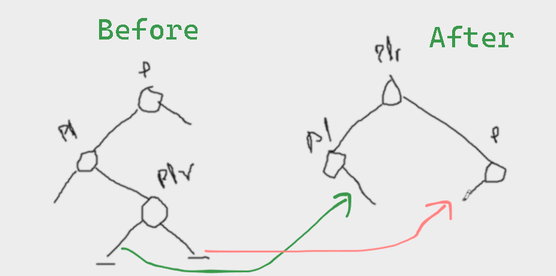

# LLrotation formula diagram

here p=node  
pl=nodel  
plr=nodelr  
Here height(balance factor) of p and pl should change  

# LRrotation formula diagram

here p=node  
pl=nodel  
plr=nodelr
Here height(balance factor) of p, pl and plr should change  

# RRrotation formula diagram

here p=node  
pr=noder  
prl=noderl  
Here height(balance factor) of p, pl and plr should change  

# RLrotation formula diagram

here p=node  
pr=noder  
prl=noderl  
Here height(balance factor) of p, pl and plr should change  

