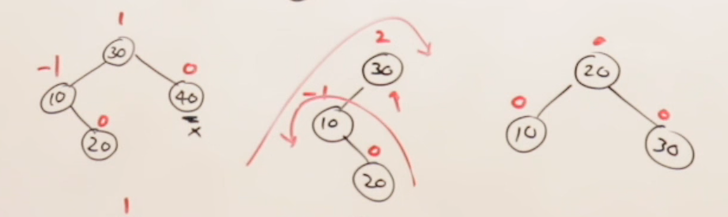

# Deletion
## There are 6 types of rotation for deletion:  
* L1  (Left 1)
* L-1 (Left -1)
* L0  (Left 0)
* R1  (Left 1)  
* R-1 (Left -1) 
* R0  (Left 0)

## L1 

*  because its first left node has balance factor is 1
* Node is deleted from Right side 
* here we perform LL Rotation
## L-1

*  because its first left node has balance factor is -1
* Node is deleted from Right side 
* here we perform LR Rotation
## L0 

*  because its first left node has balance factor is 0
* Node is deleted from Right side 
* here we can perform L1 or L-1 Rotation

### R0, R1, R-1 are similar to L0, L1, L-1. They are just like mirror images of them

