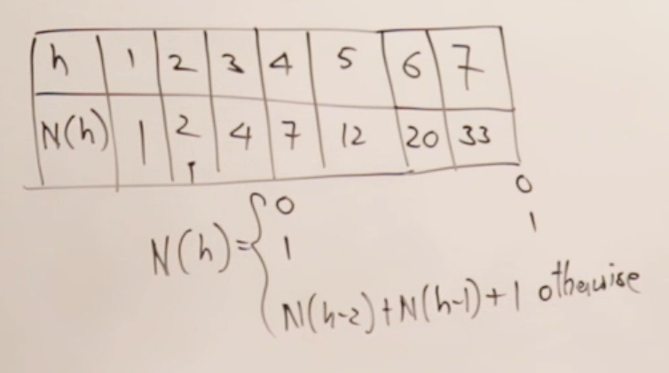

# Height vs Nodes
*taking height from 1 onwards*  

It means  
how many nodes are required to get min/max height  
### or  
what is height for given no. of nodes

## Min Nodes

## Formula :

no. of nodes current height =(SUM of no. of nodes requrired for previous 2 heights) + 1  

i.e., N(h)=N(h-1)+N(h-2)   (Same as <b>Fibonacci sereies</b>)  
      if h=1 ,N(h)=1  
      if h=0 ,N(h)=0 

## Max Nodes 
N(h)=2^(h)-1

## Min Height
h=log(n+1)

## Max Height

Approx Formula = 1.44 * log(n+2) 

<b>Alternative :</b>  
use above table given in the image of Min Nodes to get the max height  
For example :  
* if you have no of nodes(n)=15
* then it lies in the range of 12 to 20   
* so upto 20 min height is 5  
* Therefore max height for n=15 is 5

### Image Refernce:
