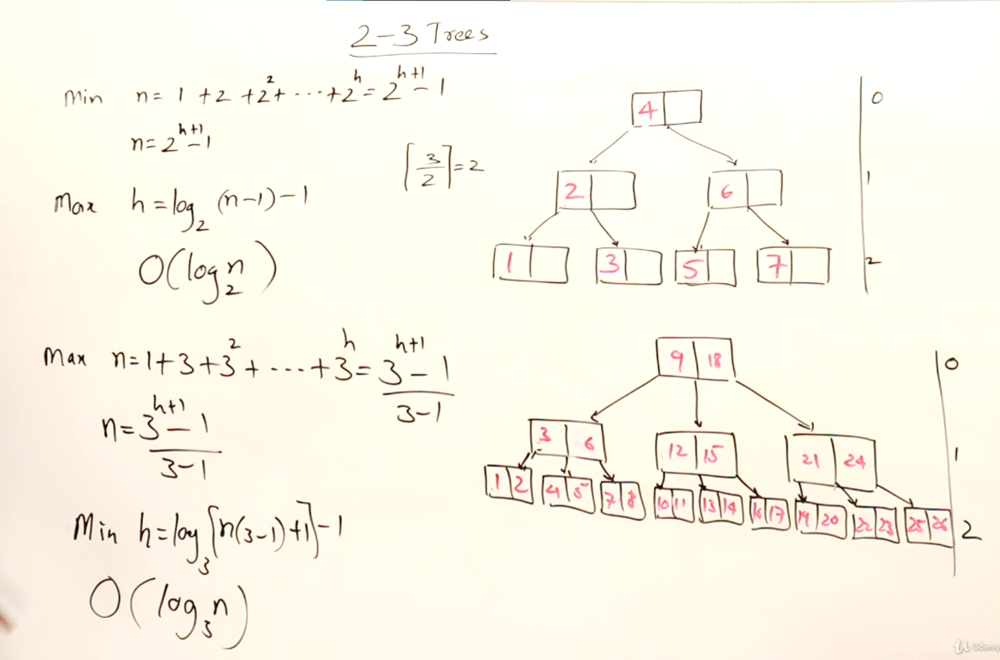

# 2-3 Trees

* keys inside node should be in sorted order(k1< k2)
* L < k1, k1 < m < k2, k2 < n
* no duplicates
* grow upwards, hence maintains the balance

## Insertion

* split when there is more keys 
* if there is space in node, place the new key there

## Deletion

### *Pre-requisites:*

### Merging : reverse of splitting of nodes

* This method is used when the key is deleted and the node become vacant 
* If the middle node gets vacant, you can merge it with either left or right sibling(right preferable)

### Borrowing 

### *Reference Image*

* <b>Case 1:</b> delete 90  
simpliy delete it.

* <b>Case 2:</b> delete 80  
simpliy delete it and merge the vacant node with its left one

* <b>Case 3:</b> delete 60  
simpliy delete it and merge the vacant node with either left node or right (right preferable)  
<b>or</b>  
you can borrow a key from sibling 

#### NOTE - *First always tires to borrow, else merge*

* <b>Case 4:</b> delete 20  

    + first merge
    + node becomes vacant, so borrow
    + links are modified as parent of 40 changed
    + as 1 space is vacant in node 80, so it slips left
    + links are modified accordingly

* <b>Case 5:</b> delete 50(root)
just like BST, inorder predecer or successor will take its place

## Heights vs Nodes

