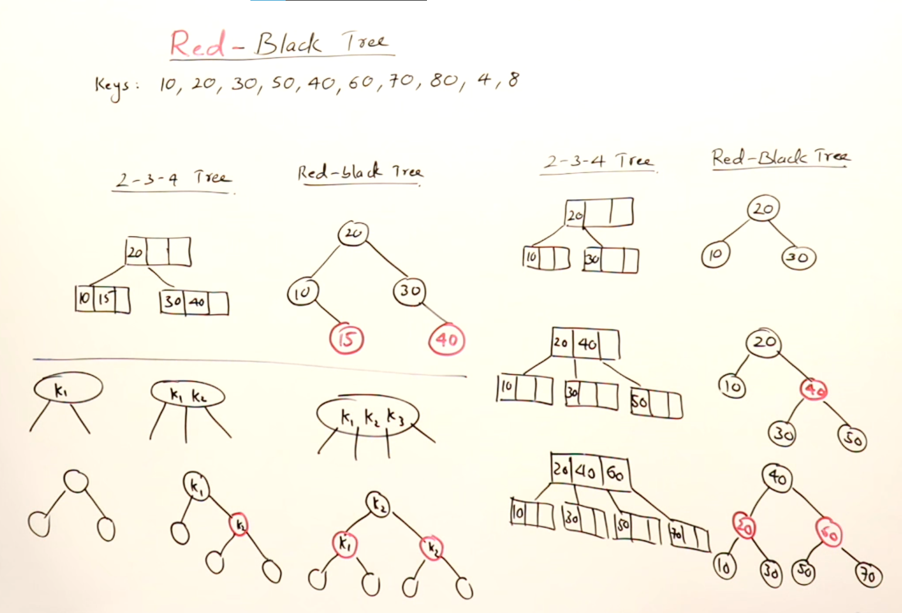
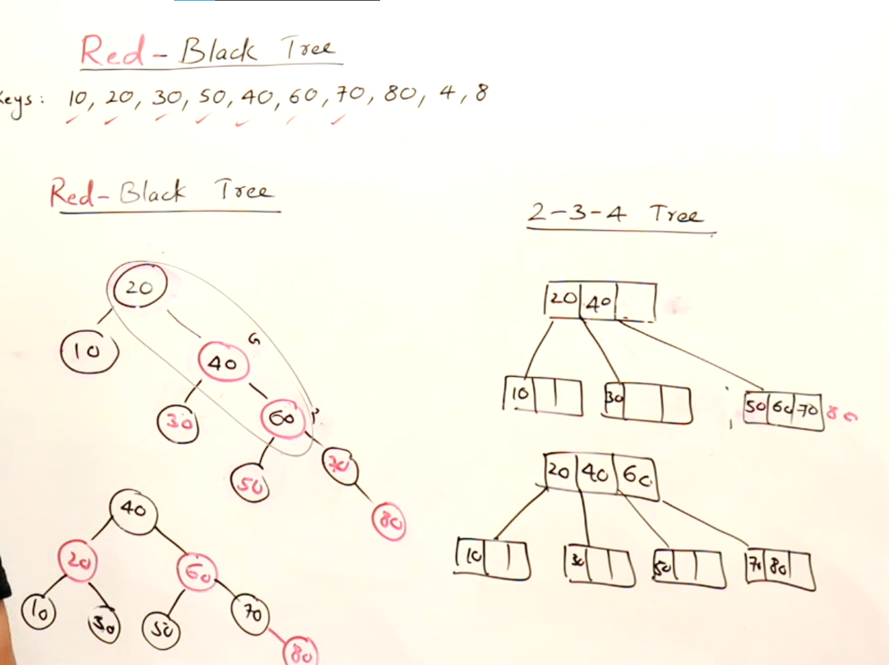
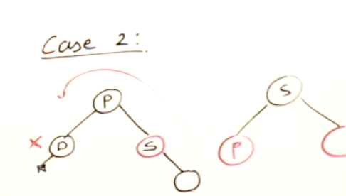
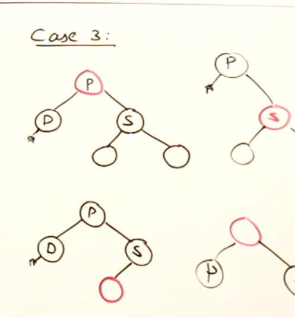

# Red-Black Trees and 2-3-4 trees are similar

* Red nodes which are child of black, are in the same node in the 2-3-4 trees as shown in fig.

## Example

# Deletion
### Points to be remember :
* when we delete a node from BST,always a leaf node(inorder predecer or successor) will take its place and that leaf node will be deleted

* leaf node which is to be deleted can have 0 or 1 children(not 2)

## Procedure: 
 * <b>Case 1:</b> if RED node is to be deleted, simply delete it(beacuse that doesn't affect no. of black nodes along a path)

 * <b>Case 2:</b> if black node is to be deleted and its SIBLING is RED, perform ROATATIONS accordingly and make sibling black and every else red  
 (in image D node is to be deleted)
 

 * <b>Case 2:</b> if black node is to be deleted and its SIBLING is BLACK:
    + if SIBLING child is BLACK, RECOLOR(Make parent black and siblings red) them
    + if SIBLING child or even SIBLING is RED, perform ROATATIONS accordingly and make SIBLING black and every else red(RECOLORING)
    

    IN SHORT : 
    * if sibling and its child is BLACK : RECOLOR
    * if sibling and its child anyone is RED : ROTATION

    NOTE- If the black node is deleted then no.of black nodes along a path will be affected. After deletion there will be a null(black) so we consider that null as double black

    
