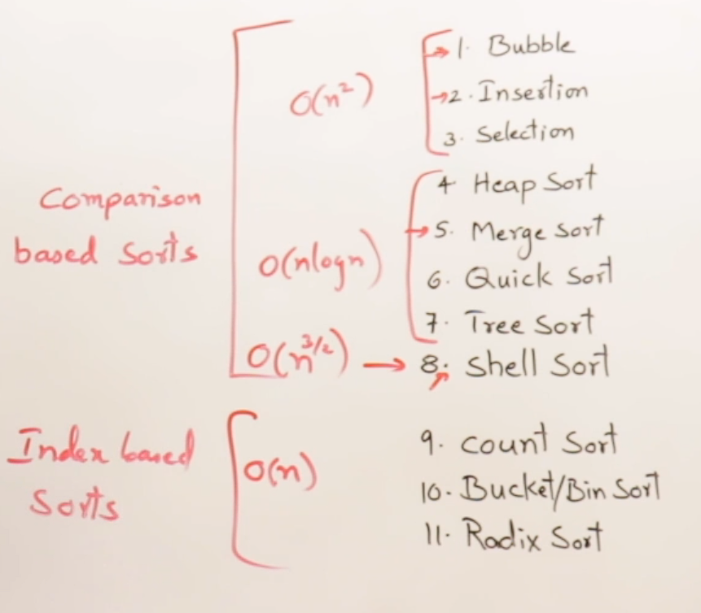
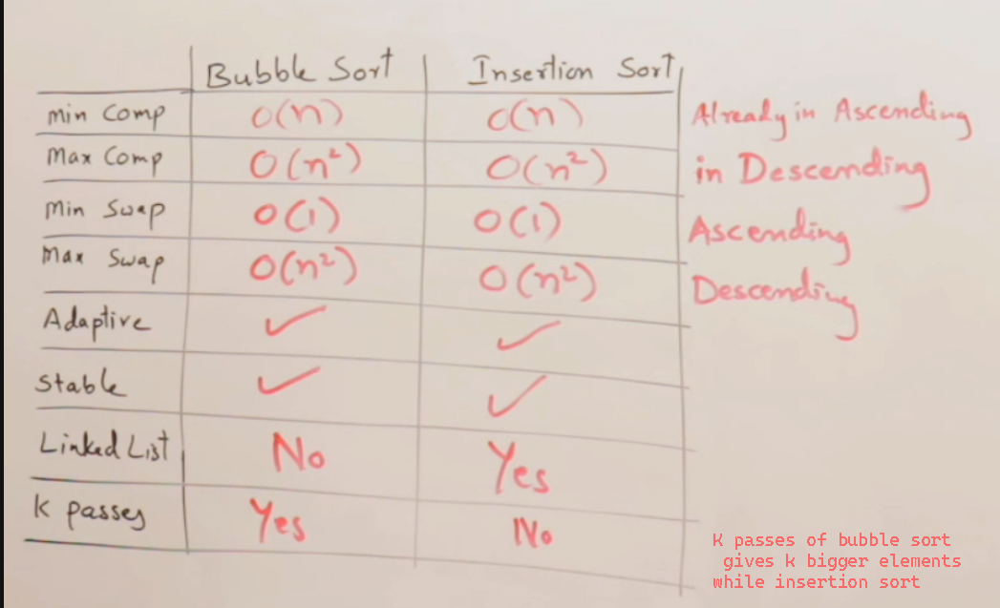
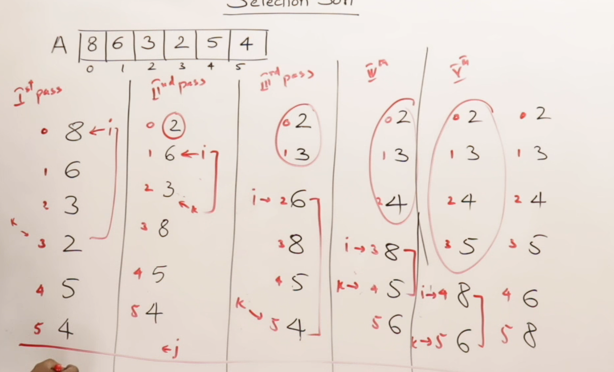

# Sorting Techniques:

## Critera for analysis :
### In one iteration
- No.of comparisons
- No.of swaps
- Adaptive (if already array is sorted then how is the perfomance)
- Stable (if array conatains same elements multiple times then the order must be preserved )
- Extra Memory

## Algorithms :

### O(n^2)

- Bubble sort
- Insertion sort
- Selection sort

### O(nlogn)

- Heap sort
- Merge sort
- Quick sort
- Tree sort

### O(n^3/2)

- Shell sort

### O(n) (But they take more space)

- Count sort
- Radix sort
- Bucket/Bin sort

#### Reference Image :

# Bubble Sort :
### In one iteration
- No.of comparisons : n-1

- No.of swaps : n-1

- Adaptive : true
  - yes we can make it adaptive(by using a flag variable and check whether it is sorted or not) with time complexity : O(n)( as no swaps are done)
- Stable : true
  - because it will swap only if the j element > j+1, if they are same nothing will happen

- Intermidiate results are useful

# Insertion Sort :

- We sort the element while inserting in array
### In one iteration
- No.of comparisons : n-1
- No.of swaps : n-1
- Adaptive : true
  - yes it is by default adaptive with time complexity : O(n)( as no swaps are done)
- Stable : true
  - because it will swap only if the the element is bigger

# Bubble sort Vs Insertion Sort :

# Selection Sort :

- During first iteration, smallest element will be sorted.
### In one iteration
- No.of comparisons : n-1
- No.of swaps : 1 (min no. swaps among all n^2 algos)
- Adaptive : no
  - it will always do 1 swap (with itself if already sorted)
- Stable : false
  - suppose there are two 8 in array and 8 is the 1st element, if any element less than min element(8) comes after 2nd 8 then it will interchange and hence no stability 

- Intermidiate results are useful

# Quick Sort :

- Use divide and conquer method
### In one iteration
#### Since it is recursive procedure so no. swaps are not imp
- No.of comparisons : n-1 (max)
- No.of swaps : n/2 (max)
- Adaptive : no
  - it will always do 1 swap (with itself if already sorted)
- Stable : false
  - suppose there are two 8 in array and 8 is the 1st element, if any element less than min element(8) comes after 2nd 8 then it will interchange and hence no stability 

- Intermidiate results are useful

