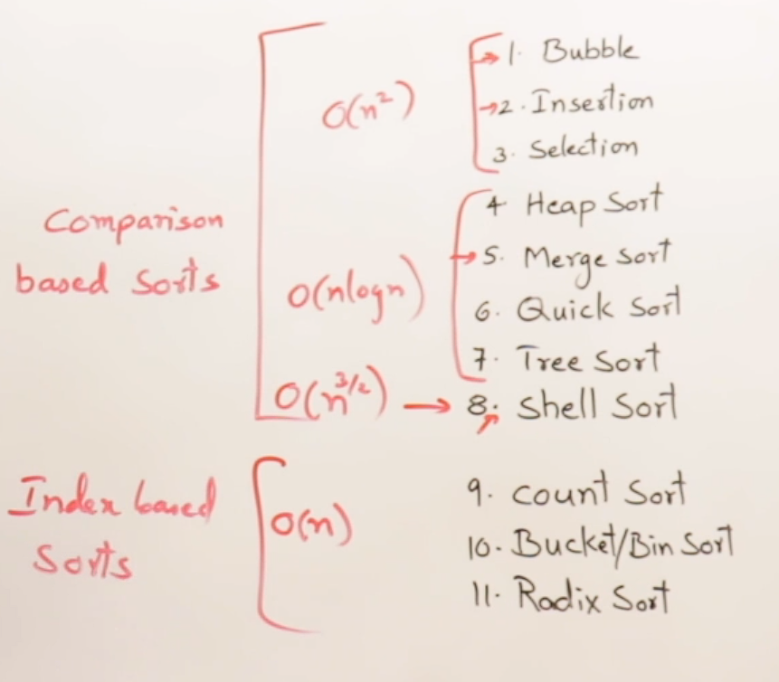
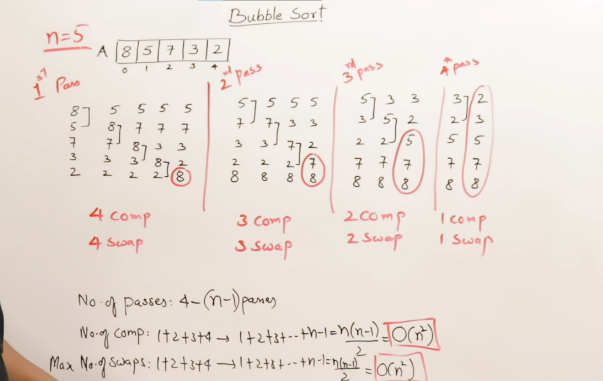
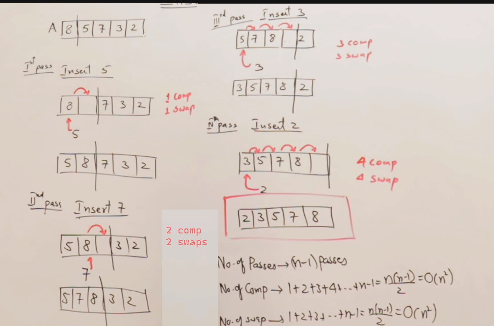

# Sorting Techniques:

## Critera for analysis :
* No.of comparisons
* No.of swaps
* Adaptive (if already array is sorted then how is the perfomance)
* Stable (if array conatains same elements multiple times then the order must be preserved )
* Extra Memory

## Algorithms :
### O(n^2)
* Bubble sort
* Insertion sort
* Selection sort
### O(nlogn)
* Heap sort
* Merge sort
* Quick sort
* Tree sort
### O(n^3/2)
* Shell sort
* Merge sort
* Quick sort
* Tree sort
### O(n) (But they take more space)
* Count sort
* Radix sort
* Bucket/Bin sort

#### Reference Image :

# Bubble Sort :

* No.of comparisons : n-1

* No.of swaps : n-1

* Adaptive : true 
    + yes we can make it adaptive(by using a flag variable and check whether it is sorted or not) with time complexity : O(n)( as no swaps are done)
    
* Stable : true 
    + because it will swap only if the j element > j+1, if they are same nothing will happen

# Bubble Sort :

* In array we have to shift the elements but not in linked list, that's it works better in linked list

* No.of comparisons : n-1
* No.of swaps : n-1
* Adaptive : true 
    + yes we can make it adaptive(by using a flag variable and check whether it is sorted or not) with time complexity : O(n)( as no swaps are done)
* Stable : true 
    + because it will swap only if the j element > j+1, if they are same nothing will happen

