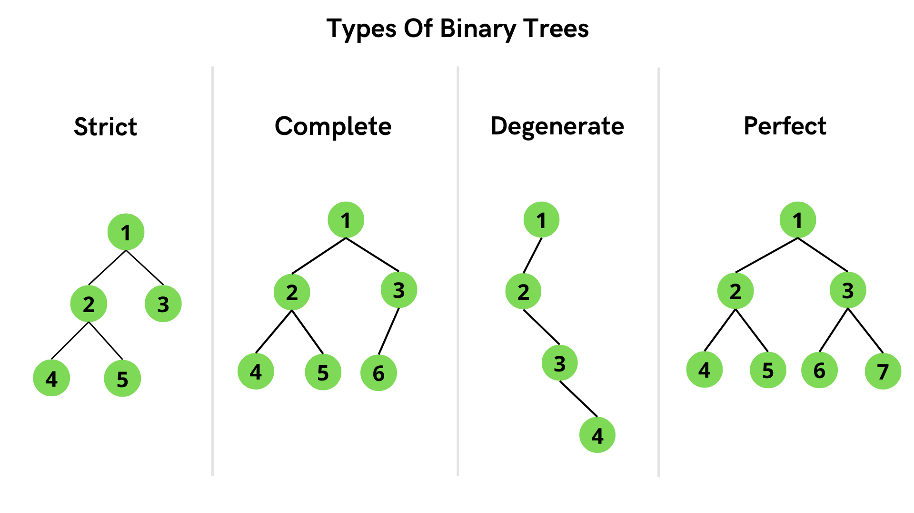

# UNLABLED nodes

1.no. of tree combination with given no. of nodes(catalan no.)  
i.e., t(n) = (2n^Cn)/(n+1)  
2.height start from 0  
3.level start from 1  
4.no. of trees with max height=2^(n-1)  
5.alternate catalan no. = sum(t(i-1)*t(n-i)) , where i starting from 1 (or t(i)*t(n-i) for understanding purpose)

# LABLED nodes

catalan no.= t(n)=(2n^Cn) \* n!/(n+1) , n! is due to they can arrange in n! ways.

# NO. OF NODES w.r.t. HEIGHT in Binary Tree

min no.of nodes=height + 1  
max no.of nodes=2^(h+1) - 1

# calculate HEIGHT w.r.t. NO. OF NODES

MAX HEIGHT=n-1  
MIN HEIGHT=log(n+1)-1  
i.e., Height of Binary Tree ranges from O(logn) to O(n).  
No. of Nodes with degree 0 = No. of Nodes with degree 2 + 1  
i.e., n(degree(0))= n(degree(2)) + 1  
or e = i + 1

# STRICT Binary Trees

Tree having only 0 children or 2 children

Min height = 2\*h+1  
Max Height= 2^(h+1) - 1

MAX HEIGHT=(n-1)/2  
MIN HEIGHT=log(n+1)-1

no. of internal External Nodes = No. of internal Nodes + 1  
i.e., n(External Nodes)=n(internal Nodes) + 1

# n-ary trees

Here n= Degree of tree  
Degree= max no. of children a tree can have.

## STRICT(Proper) n-ary trees

Every node can have only 0 or max n children

min Nodes = n\*h+1  
max Nodes = 1+n+n^2+....+n^h (GP series)

From above equation, you can find min height and max height for given no. of Nodes.

External nodes= (m-1) _ internal nodes + 1  
n(external nodes)=(m-1) _ n(internal nodes) + 1  
where m = height no m-ary tree.  
or e = (m-1)\*i + 1

# Representation of Trees

we can represent trees by using :  
1.Arrays  
2.Linked

## Array Representation:

if Parent is stored at index =i  
left child is stored at position= 2 _ i  
right child is stored at position= 2 _ i + 1

## Linked Representation (mostly used):

create a node class with self refrence and create 2 pointers left and right  
left and right pointers of leaf nodes should be null  
no. of null pointers = no. of nodes + 1  
similar to e = i + 1

# Complete Binary Tree VS Full(Perfect) Binary Tree

### Complete Binary Tree:

Data in Tree should be filled from left to right

or

While representing tree in array, there should be <b>no blank space</b> in array

#### BOOK DEFINATION :

A complete binary tree of height h , will be a full binary tree upto height h-1 and in last level, elements are filled from left to right without skiping any element

### Full Binary Tree:

If all the elements are filled upto level h.

# Tree Traversals:

1. Preorder
2. Inorder
3. Postorder
4. Level order

### Preorder:

root left right

### Inorder:

left root right

### Postorder:

left right root

### Level order:

write nodes level by level
